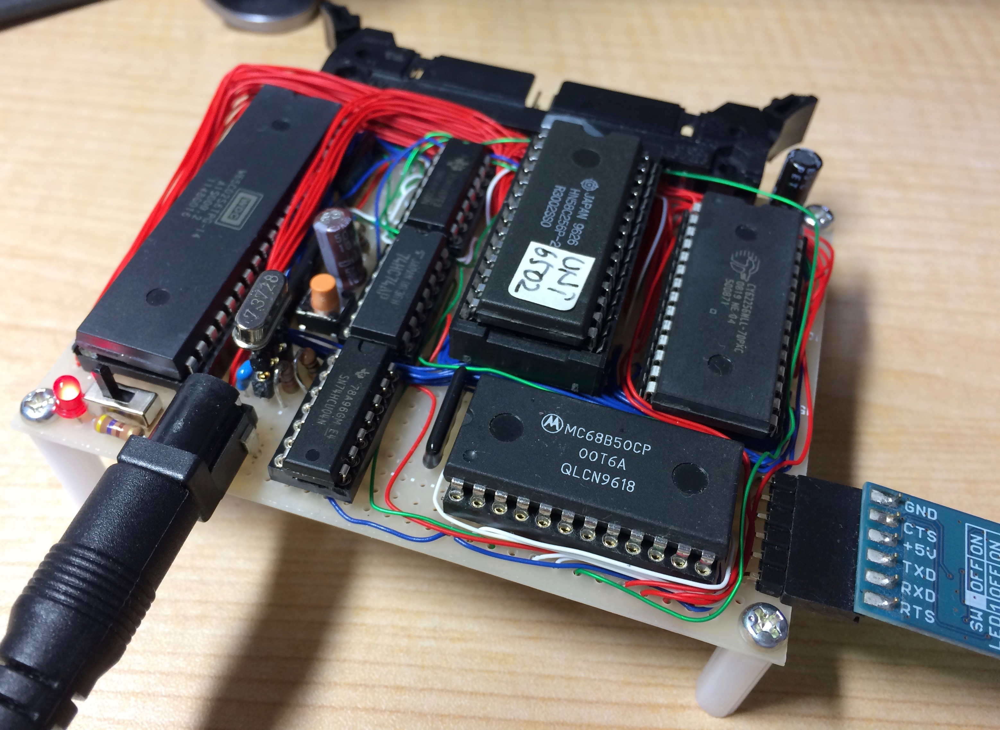
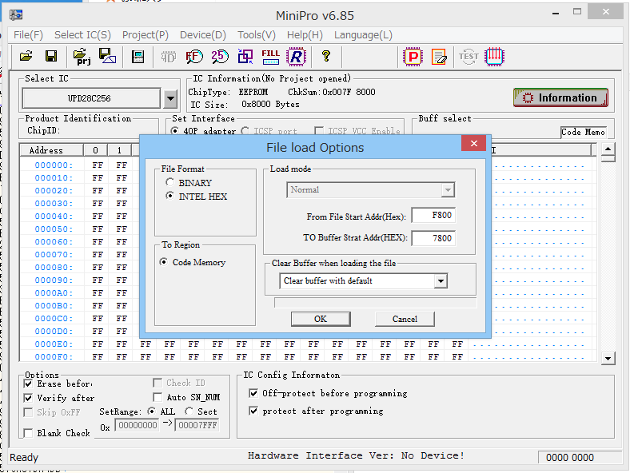

= 6502CPU シングルボードコンピューター =

== 概要 ==
* 6502CPUを使用したシングルボードコンピューターです。

== 特徴 ==
* Grantさんが公開している 6502コンピューターとアドレスを合わせてありますので、同じソフトが動きます。

== ディレクトリの説明 ==
* 回路図はimgディレクトリに入っています。
* KiCADデータはKiCadディレクトリです。
** 回路図の6502のシンボルは https://github.com/Alarm-Siren/6502-kicad-library[6502 KiCad Library]の成果を使用させていただきました。

* srcディレクトリにUniversal Monitor (Electrelicさん作)の移植用ソースを添付します。MC6850対応ドライバーを含んでいます。アセンブル済みのhexファイルも添付します。
** 28C256(256k)タイプのEEPROMへ、IntelHex形式のファイルから書き込んで使用してください。
** 書き込みの際、TL866CSを使う場合は、以下のように$Fxxxは$7xxxへ読み替える指定をしてください。

== 参考 ==
* Grant's 8-chip (or 7-chip) 6502 computer
** http://searle.x10host.com/6502/Simple6502.html
* Universal Monitor (Electrelicさん)
** https://electrelic.com/electrelic/node/1318
* 6502 KiCad Library
** https://github.com/Alarm-Siren/6502-kicad-library
